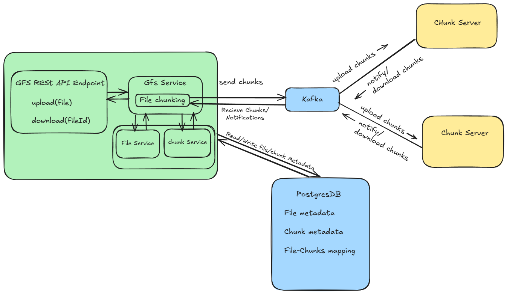

## High Level Design




## Steps to follow:
  
  ### Step 1: Build Server1 Image
  1. Open terminal and goto gfsServer1 Directory
  2. type the command  **docker build -t server1 .**
     
  ### Step 2: Build Server2 Image
  1. Open terminal and goto gfsServer1 Directory
  2. type the command  **docker build -t server2 .**
  
  ### Step3: Start Docker Containers:
  1 Run the **docker-compose.yml** file by typing **docker-compose up -d**
  - this will start and run containers for Postgres, Kafka and GFS servers 
  
  ### Step 4: Run the GFS client
  1. goto directory **gfs/src/main/java/com/cloud/gfs/** and run the **GfsApplication.java** file.
  
  ## Step 5: API Testing with Postman  
  ### Running the API  
  
  To test the API using Postman, follow these steps:  
  
  1. Open Postman and create a **POST** request.  
  2. Set the request URL to:  http://localhost:8080/gfs
  3. In the **Body** tab, select **raw** and choose **JSON** as the format.  
  4. Provide the following JSON payload:  
  
  ```json
  {
    "file": "{your file path}",
    "fileName": "{your file name}",
    "fileExtension": "{your file extension}",
    "fileSize": "{your file size}"
  }
